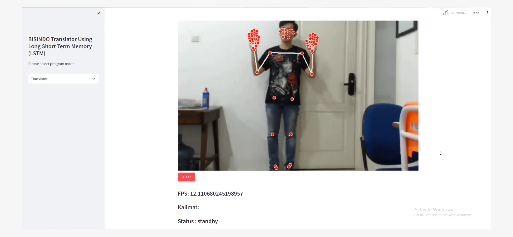
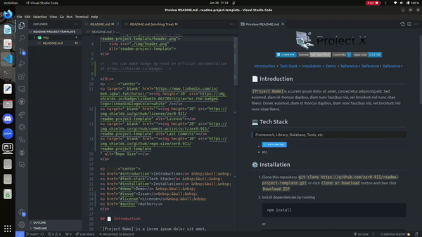

<!-- git remote add origin https|ssh:path/to/the/repository.git  -->
<!-- git pull origin main --rebase -->

<h1> Erina - Effective Real-time BISINDO Translator </h1>

<!-- You can make badge by read on official documentation at https://shields.io/badges -->

<a href="#-introduction">Introduction</a> &nbsp;&bull;&nbsp;
<a href="#-tech-stack">Tech Stack</a> &nbsp;&bull;&nbsp;
<a href="#%EF%B8%8F-installation">Installation</a> &nbsp;&bull;&nbsp;
<!-- <a href="#%EF%B8%8F-demo">Demo</a> &nbsp;&bull;&nbsp; -->
<a href="#-reference">Reference</a>&nbsp;&bull;&nbsp;
<a href="#-issue">Issue</a>&nbsp;&bull;&nbsp;
<a href="#-license">License</a>&nbsp;&bull;&nbsp;
<a href="#-author">Author</a>

## 📄 Introduction

Sign language primarily uses body movements and facial expressions to convey messages. In Indonesia, as of 2015, there were 2.9 million people with hearing impairments. This number is significant compared to the total population of Indonesia. However, this is not matched by the general public's understanding of sign language, resulting in communication barriers and hindering the quality of life for individuals with hearing impairments.

To address this, I developed a web-based application called `Erina - Efficient Real-time Indonesia Sign Language Translator` that translates sign language into sentences and converts them into speech. Currently, existing translator systems only display text, so forming sentences and converting them to speech further facilitates more natural communication for individuals with hearing impairments. Erina has successfully translated 8 vocabulary words with an accuracy of up to 100% under various conditions of distance, lighting, subject, and sentence formation.

## 💻 Tech Stack

> Framework, Library, Database, Tools, etc

<!-- You can search the logo with https://simpleicons.org and copy the name in logo=copyhere same with color after badge/YourText-YourColor-->

- Python
- Tensorflow
- Streamlit
- Mediapipe
- Visual Studio Code
- NGINX

## ⚙️ Installation

1. Clone this repository `https://github.com/krsx/erina-bisindo-translator` or click `Clone or Download` button and then click `Download ZIP`
2. Install the required dependencies
3. Run the program by using `streamlit run app.py`
4. Access the program through your browser

<!-- ## 📽️ Demo

<!-- If Needed  -->
<!-- 

    

 -->

## 📚 Reference

<!-- If Needed -->

- [Long Short Term-Memory (LSTM)](https://keras.io/api/layers/recurrent_layers/lstm/)
- [MediaPipe](https://ai.google.dev/edge/mediapipe/)
- [Streamlit](https://streamlit.io/)

## 🚩 Issue

If you found a bug or an issue, please report by opening a new issue on [this repository]([https://github.com/zer0-911/paper-drone/issues](https://github.com/krsx/erina-bisindo-translator/issues)).

## 📝 License

This project is licensed under the **MIT** License - see the [LICENSE](LICENSE) file for details

## 📌 Authors

<h3> I Putu Krisna Erlangga </h3>

